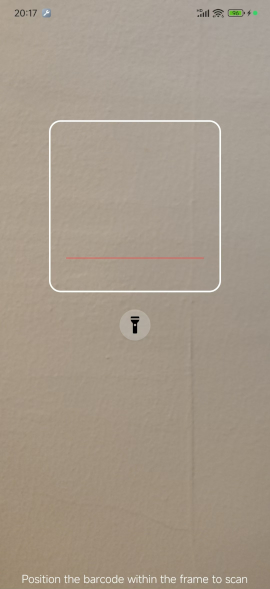

# MLKit Barcode Scanner

[ ](https://npm-stat.com/charts.html?package=cordova-plugin-ia-mlkit-scanner)
[](https://npm-stat.com/charts.html?package=cordova-plugin-ia-mlkit-scanner)

Scan barcodes using [Google MLKit](https://developers.google.com/ml-kit/vision/barcode-scanning).

This plugin is improved version of [cordova-plugin-ia-mlkit-scanner](https://github.com/IntelliAcc/cordova-plugin-ia-mlkit-scanner) plugin.

New features are:
- replace red lines with a white rectangle
- animation to simulate scanning
- fullscreen (also includes status bar)
- move torch button below the white rectangle
- can display a prompt text in bottom of the screen

Drawback:
- only use back camera
- remove the input box



## Local installation

```
cordova plugin add https://github.com/pierresh/cordova-plugin-ia-mlkit-scanner

```

## Usage

### Barcode Scanner

To call up the barcode scanner, refer to this example code for Typescript:

```typescript
function onSuccess(barcode) {
  console.log("Success:" + barcode);
}

function onError(message) {
  console.log("Error:" + message);
}

(<any>window).window["MLKitBarcodeScanner"].scanBarcode({ prompt: "Scan a barcode"}, onSuccess, onError);
```

---

### Check Play Service Availability (ANDROID)

As this plugin is based on Google's MLKit, Play services is required for it to function correctly on Android devices. You can check if the host device has support, by calling **checkSupport**:

```javascript
function onSuccess(isSupported) {
  console.log("Has Support: " + isSupported);
}

function onError(message) {
  console.log("Error: " + message);
}

(<any>window).window["MLKitBarcodeScanner"].checkSupport(onSuccess, onError);
```
